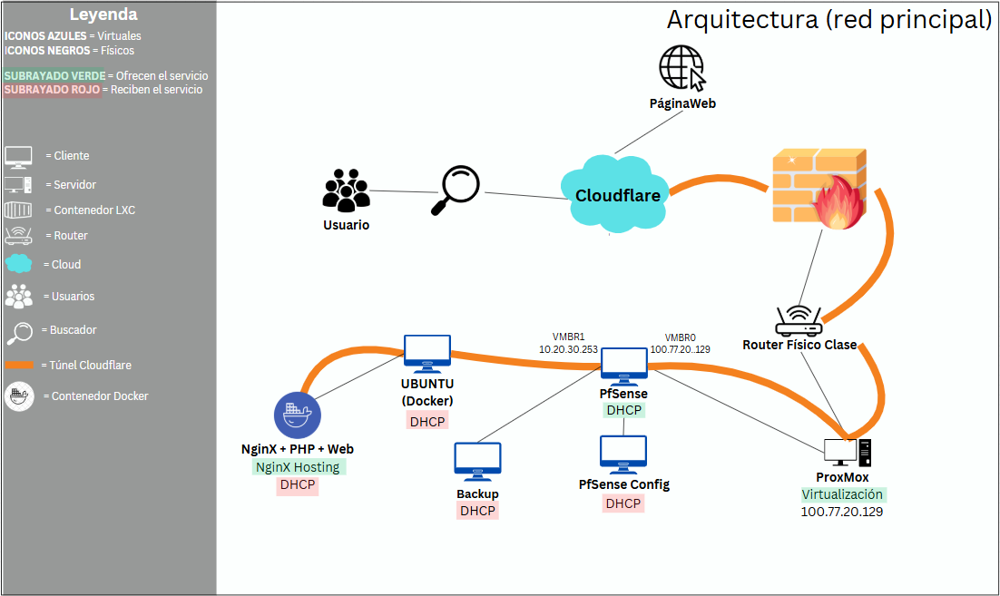
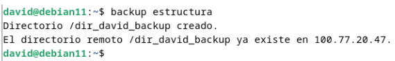
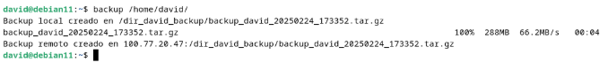
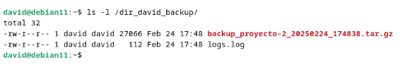
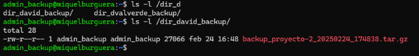
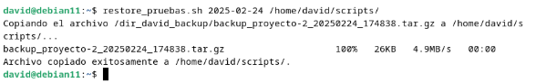
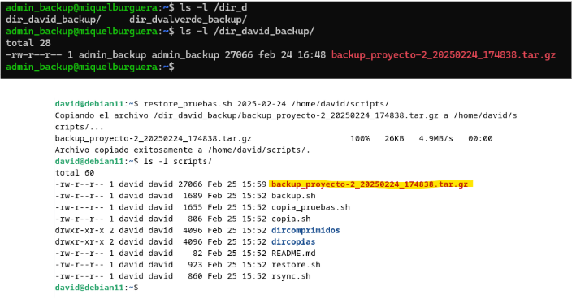

# ASIX2_Monitorización y Gestión de Dispositivos de Red_TMD <br> Desarrolladores: Miquel Burguera, Tim Kalugin, David Valverde.

## 💡  Explicación de la idea del proyecto
<details>
  <summary>Explicación 🔽</summary>
Monitorización y Gestión de Dispositivos de Red

Este proyecto desarrolla una **Herramienta por terminal para sistemas Linux** destinada al **análisis de redes** y la **gestión de dispositivos** en infraestructuras empresariales. La plataforma ofrece un **dashboard interactivo** que permite monitorizar en tiempo real el **uso de CPU y memoria** de dispositivos de red como routers y switches, así como el **ancho de banda consumido** por los clientes y la identificación de **dispositivos conectados** mediante DHCP. Además, facilita la **configuración remota** de servidores DHCP y DNS, y la **gestión automatizada de reglas de firewall** a través de scripts personalizados.

Para la recopilación de datos, se emplean protocolos como **SNMP** o **Netconf**. El procesamiento y la interacción con los dispositivos se realizan utilizando **PHP** y **Python**. La interfaz web está servida por **Nginx**.

Esta solución centraliza y optimiza la **monitorización** y **administración de redes**, mejorando la **eficiencia operativa** y reforzando la **seguridad** en entornos corporativos.

**Palabras clave**: análisis de red, gestión de dispositivos, monitorización, SNMP, Netconf, automatización de firewall, PHP, Python, Nginx.
</details>

<details>
<summary>Funcionalidades 🔽</summary>

  - Gestión de redes virtuales y máquinas virtuales con múltiples interfaces conectadas a un entorno físico y simulado.
  - Gestión de reglas de firewall.
  - Configuración remota a través de SNMP.
  - PfSense con tres interfaces configuradas: WAN, LAN y una red simulada.
  - DHCP y DNS centralizados a través de pfSense para toda la red principal.
  - Redireccionamiento de tráfico, control de acceso y segmentación de red.
  - Página web alojada en contenedor de Docker.
  - Copia de seguridad.
  - Red simulada con su propio servidor con servicios de DHCP, Ldap y FTP.
  - Uso de CPU y memoria de dispositivos (routers, switches).
  - Ancho de banda usado por los clientes.
  - Monitoreo de las IPs, sistemas operativos, nombres de host y MAC address.
  - Clasificación por tipo de dispositivo

</details>

## 📝  Organización y roles del equipo
<details>
  <summary>Organización 🔽</summary>

  Hemos decidido respetar los intereses y la motivación de cada miembro del equipo en cuanto a los aspectos de nuestro proyecto en los que desean trabajar. De este modo, todos podemos aprender más sobre las áreas en las que consideramos que podemos enfocarnos como futuras carreras profesionales. No obstante, siempre se garantiza la colaboración y el apoyo entre los integrantes del equipo en caso de no cumplir con los objetivos dentro de los plazos establecidos. 
  
  Al final de cada clase se pondrá en común el trabajo de cada integrante, con el objetivo de que todas las personas en todo momento sepan que se ha hecho ese día y si algún día hay una baja, que se pueda seguir trabajando con normalidad.

</details>

<details>
  <summary>Roles 🔽</summary> 
  
  - David - Programación, documetación (GitHub)
  - Miquel - Sistemas, Redes, documentación (GitHub)
  - Tim - Sistemas, Redes, documentación (GitHub)
</details>

## 💻  Tecnologías a utilizar (lenguajes, framework, sistemas, software...)
<details>
  <summary>Front-end 🔽</summary>

  - HTML
  - CSS
  - Bootstrap
  - Colores a utilizar en el front-end: pendientes a elegir
</details>

<details>
  <summary>Back-end 🔽</summary>

   - Python 
   - PHP
</details>

<details>
  <summary>Software 🔽</summary>
  
  - Visual Studio
  - Trello
  - GitHub
  - Cloudflare
  - Pi-hole
  - Nginx

</details>

## 🔨  Arquitectura del sistema
<details>
  <summary>Explicación 🔽</summary>

Esta red está diseñada bajo una arquitectura cliente-servidor con varios niveles de segmentación para mejorar la seguridad y la eficiencia en la gestión de servicios.

Infraestructura General
La infraestructura está basada en un hipervisor Proxmox VE 8.2.2, que aloja varias máquinas virtuales y contenedores para proporcionar diferentes servicios.

Componentes y Funcionalidad
PfSense (Firewall + DHCP): Controla el tráfico de red y asigna direcciones IP dinámicamente.
Servidor de Backup (Ubuntu Server 22.04.2): Se encarga del almacenamiento y la recuperación de datos.
Ubuntu (Docker): Aloja los contenedores.
Cloudflare: Ofrece seguridad adicional y optimización del tráfico web a través de un túnel.
</details>

<details>
  <summary>Tabla de arquitectura de los sistemas (red principal) 🔽</summary>
  
  | Máquina       | S.O                  | Almacenamiento / Memoria|    Servicio    | 
  |---------------|----------------------|-------------------------|----------------|
  | **Proxmox**   |Proxmox-VE 8.2.2      | 93Gb / 8Gb              |   Hypervisor   |
  | **PfSense**   |FreeBSD 1.0.0         | 25Gb / 4Gb              |  DHCP+Firewall |
  | **Backup**    |Ubuntu server 22.04.2 | 20Gb / 4Gb              |     Backup     |
  | **Docker**    |Ubuntu server 22.04.2 | 20Gb / 2Gb              |     Hosting    |
</details>

<details>
  <summary>Esquema provisional 🔽</summary>


  
</details>

## :whale:  Docker
<details>
  <summary>Introducción 🔽</summary>

En este proyecto vamos a implementar Docker, una plataforma de contenedorización que permite crear, desplegar y ejecutar aplicaciones en contenedores. Distingue por su portabilidad y consistencia, esto significa que nos permite trabajar desde cualquier sitio desplegando la misma imagen en otro servidor, nube, etc. Además nos proporciona un aislamiento de los servicios, en caso de tener algún fallo en un contenedor, el servicio afectado será únicamente el que se almacenaba dentro de este contenedor. Por último, los contenedores docker comparten el mismo kernel del sistema operativo, lo que permite reducir el consumo de RAM, CPU y memória física, optimizando el tiempo del arranque, desarrollo y apague de los servicios.   

</details>

<details>
  <summary>Información básica 🔽</summary>

¿Qué son los contenedores de docker?
  - La función principal de los contenedores Docker es desarrollar, enviar y ejecutar cualquier aplicación en cualquier sistema, constituyéndose así como una alternativa flexible y capaz de ahorrar recursos frente a la emulación de componentes de hardware basada en máquinas virtuales (VM).

¿Qué diferencias hay entre los contenedores de docker y los lxc?
  - LXC: es un tipo de contenedor de sistema lo que significa que todos los contenedores creados con LXC necesitan un sistema operativo propio para funcionar, podemos tener en un solo contenedor diferentes aplicaciones, más parecido a una máquina virtual, es neutral en cuanto al sistema de archivos, permite guardar datos dentro o fuera del contenedor, facilita la construcción de pilas acopladas o compuestas.
  - Docker: utiliza el sistema operativo del sistema anfitrión (kernel), solo un contenedor para un servicio, es más ligero y modular, se basa en capas de solo lectura mediante AUFS o DeviceMapper, sus instancias son efímeras, y los datos persistentes deben almacenarse en bind mounts o volúmenes de datos.

¿Cuál es la diferencia entre una imagen y un contenedor en docker?
  - Imagen: una imagen es una plantilla fija que contiene el sistema de archivos y la configuración necesarios para ejecutar una aplicación. Si se necesita realizar cambios, hay que crear una nueva imagen a partir del contenedor creado a partir de la imagen inicial.  
  - Contenedor: un contenedor es una instancia de ejecución de una imagen, aunque la imagen contenga todo lo necesario para ejecutar una aplicación no podrá ser ejecutada sin un contenedor. El contenedor es modificable pero, los cambios que se implementan no afectan a la imagen base. Un contenedor puede ser eliminado o detenido sin afectar la imagen. 

¿Qué sucede con los datos cuando un contenedor se elimina?
  -  Cuando un contenedor es eliminado todos los datos no persistentes se borran si no se usan volúmenes o bind mounts.
  -  Volúmenes:  se almacenan fuera del sistema de archivos del contenedor y pueden ser reutilizados por otros contenedores.
  -  Bind Mounts: permite acceder y modificar archivos dentro y fuera del contenedor. 

¿Cuáles son las ventajas de utilizar contenedores de docker?
  - Entre todas las ventajas que proporciona el uso de contenedores de docker destacan las siguientes: la ejecución en cualquier sistema que tenga instalado el docker, el arranque más rápido, menor consumo de los recursos, ejecución independiente de cada contenedor, facilidad de desarrollo y despliegue.

¿Qué tipo de aplicaciones y servicios se pueden desplegar con docker?
  - Docker es muy versátil a la hora del despiegue de las aplicaciones y servicios, puede desplegar aplicaciones web, APIs, BBDD y almacenamiento (MySQL, MongoDB, Elasticsearch, etc.), sistemas de mensajería y colas de trabajo (RabbitMQ, NATS, etc.), entornos de desarrollo y testing (Jenkins, GitLab CI/CD...), servicios de monitoreo y logging (Grafana, Prometheus, etc.), creación de arquitecturas basadas en microservicios utilizando Docker Compose o Kubernetes, aplicaciones de Inteligencia Artificial y Big Data (Jupyter Notebooks, Spark, etc.), VPNs y redes privadas (WireGuard, OpenVPN, Pi-hole, etc.), aplicaciones empresariales y ERP/CRM (WordPress, Magento, etc.)

¿Qué otros tipos de contenedores existen además de Docker?
  - A parte de contenedores LXC y Docker existen otros contenedores para unos u otros propósitos: Podman (alternativa a Docker, utiliza los mismos comandos y no necesita un daemon en segundo plano), CRI-O (más optimizado para Kubernetes), Singularity (usado en entornos científicos), Kata Containers (combina virtualización ligera con seguridad similar de las VMs), Firecracker (contenedores livianos, elaborados por Amazon).

**Webgrafía** [Dockerdocs](https://docs.docker.com/) [DockervsLXC](https://www.upguard.com/blog/docker-vs-lxc) [Codeandcoke](https://despliegue.codeandcoke.com/apuntes:docker)
 
</details>

<details>
  <summary>Despliegue de aplicación web 🔽</summary>

Para el despliegue de la aplicación web vamos a utilizar una herramienta de orquestación de los contenedores dentro del mismo cliente, **docker-compose**.  

Para descargar **docker-compose** necesitamos tener instalada la herramienta de Docker en sistema que vamos a trabajar. Una vez descargadas ambas herramientas comprimimos todos los archivos de nuestra web almacenada en un directorio en windows y los pasamos a la nuestra máquina especificando el nombre del **.zip**, el usuario y la ip de nuestra máquina. 

Una vez que tengamos nuestros archivos en nuestra máquina virtual, los descomprimimos y organizamos la estructura de directorios de la web a nuestro gusto. Una posible opción sería crear una carpeta general con el nombre del proyecto y, dentro de ella, cuatro carpetas para los diferentes servicios, en nuestro caso son: nginx, web, mysql y sql. 

Pasamos a la configuración del archivo más importante de todos, el ```docker-compose.yml``` dentro del cuál definiremos los contenedores que se van a desplegar y que dependencias van a tener entre ellos. 
Ejemplo de definición del servicio de base de datos:

```

# MySQL database service
db:
  image: mysql
  container_name: miDB
  ports:
    - "3306:3306"
  environment:
    MYSQL_ROOT_PASSWORD: 1234
  volumes:
    - ./mysql:/var/lib/mysql
    - ./sql:/db
  networks:
    - netweb

```

Finalmente añadimos el archivo de configuración **default.conf** dentro de la carpeta de nginx.
 
```
# comandos usados

sudo apt install docker-compose                        # instalación del servicio
sudo scp nombre_archivo.zip usuario@ip:.               # comprimir todo en .zip y pasar al sistema de trabajo
sudo unzip nombre_archivo.zip                          # descomprimimos dentro de máquina con docker
sudo nano docker-compose.yml                           # modificación del archivo de definición de los servicios
docker-compose up                                      # despliegue de la aplicación
docker-compose down                                    # detener la ejecución de los contenedores
docker-compose ps                                      # listar los servicios desplegados y contenedores asociados

```
  
**Webgrafía** [Adictosaltrabajo](https://adictosaltrabajo.com/2022/12/19/despliegue-de-aplicaciones-con-docker-compose/) 

</details>

## :bricks: PfSense
<details>
    <summary>Introducción 🔽</summary>

El software pfSense es una distribución personalizada, libre y de código abierto de FreeBSD, diseñada específicamente para usarse como cortafuegos y enrutador, que se administra completamente a través de una interfaz web. Además de ser una plataforma de cortafuegos y enrutamiento potente y flexible, incluye una larga lista de características relacionadas y un sistema de paquetes que permite una mayor capacidad de expansión sin agregarle volumen ni posibles vulnerabilidades de seguridad a la distribución base.

</details>

<details>
  <summary>Configuración + PortForwarding 🔽</summary>

[pfSense](documentos/pfSense.pdf)

**Webgrafía** [pfSense](https://www.pfsense.org/)

</details>

## 🔄💾 Backup
<details>
  <summary>Introducción 🔽</summary>

En el mundo que vivimos la información se ha convertido en uno de los recursos más importantes la pérdida del cuál puede tener consecuencias muy graves para una empresa. Un backup o una copia de seguridad permite almacenar un respaldo de los datos originales en otro dispositivo o ubicación para recuperarlos en caso de pérdida o corrupción de la versión original. 

El sistema de copias de seguridad de nuestro proyecto es desplegado en la máquina del trabajador, cargando el script en memoria (/usr/local/bin). El script deberá de tener los permisos de ejecución para poder utilizarlo de manera apropiada. Se puede indicar de manera manual el tipo de copia que se desea hacer sea incremental o completa, está ajustado a las necesidades del usuario para que pueda tener una copia lo más reciente posible independientemente de los horarios del backup automantizado. 

</details>

<details>
  <summary>Pasos para generar backup manualmente 🔽</summary>

Fase preparación prévia:
  - En local el usuario que efectúe el backup de manera manual deberá de tener permisos sobre **/ [sudo chown {usuario} /]**.
  - En remoto hemos creado un usuario **admin_backup** en la máquina servidor de backup que tiene permisos sobre **/ [sudo chown admin_backup /]**. Si no se han pasado las claves pedirá contraseña (password) **[ssh key-gen -t rsa] [ssh-copy-id admin_backup@100.77.20.47]**. 

</details>

<details>
  <summary>Instrucciones de copia de seguridad manual 🔽</summary>

Para crear la estructura de carpetas donde se guardará el backup por primera vez escribimos **backup estructura**. Esta sintaxis crea una carpeta en local para almacenar los comprimidos, además hace lo mismo de manera remota en máquina aparte. Así mismo aseguramos que el backup manual no falle y encuentre las carpetas hechas. 

Salida esperada: 



Una vez tengamos nuestra estructura de carpetas necesitamos introducir la sintaxis **backup [parametro 1]** para realizar la copia de seguridad. El **parámetro 1** es la ruta al directorio a realizar la copia manual. 

Salida esperada comprimirá la ruta indicada por el usuario en la ruta local y remota:



Resultados del backup en local:



Y en remoto:



</details>

<details>

<summary>Instrucciones restore sobre la copia de seguridad manual 🔽</summary>

Para realizar un restore de una copia de seguridad hay que utilizar la siguiente sintaxis: 
  - **restore [parámetro 1] [parámetro 2]**
  - Donde **parámetro 1** es la fecha del backup que se quiera recuperar en formato (año-mes-día).
  - Y **parámetro 2** es la ruta a donde se quiera traer la copia.

Salida esperada:



Resultado en ambas máquinas:



</details>

## 🛠️ EXTRAS

Este apartado recopila configuraciones y documentación de servicios que no fueron implementados en nuestro proyecto, pero que resultan relevantes y merecen atención, investigación y el tiempo dedicado a su análisis.

<details>
  <summary> 💬 Ejabberd & Pidgin </summary>

[EjabberdPidgin](documentos/Pidgin_y_ejabberd.pdf)
  
</details>

<details> 
  <summary> :unlock: OpenVPN </summary>

[OpenVpn](documentos/Openvpn.pdf)

</details>

